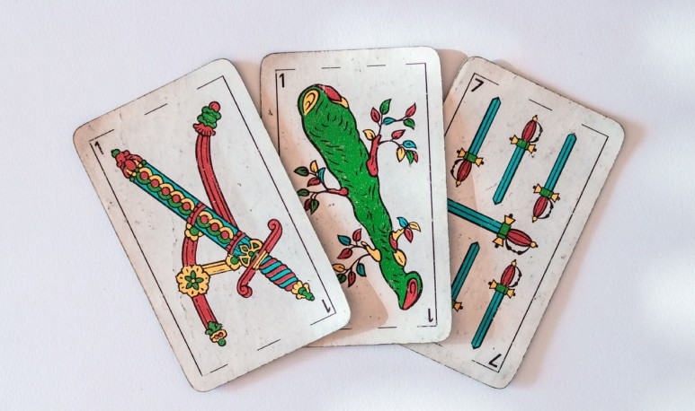

# No tengo ni 20

Esta simulacion fue una idea del taller *"No tengo ni 20: un ejemplo de los significados de probabilidad"*, dictado por el Mgtr. Guillermo Sabino en la II Jornada de Enseñanza de la Estadística.

___

## Cuál es la probabilidad de ganar el envido teniendo 28?

 

En la [notebook](https://github.com/vickyguar/prob-frecuencial/blob/main/simulacion.ipynb) se realiza una simulación que estima que la probabilidad de ganar el envido con 28 es aproximadamente 0,86. Hay un pico en el histograma de frecuencias en 7, que se da porque en cada mano estoy obligando a elegir el valor más alto. Esto no quiere decir que sea el valor que se cante en el envido, porque uno puede expresar "mesa" para decir que no se tiene ni 20 en caso de que no hayan 2 cartas del mismo palo, por ejemplo. Esto está simulado para jugar al envido en casos de que se juegue 1 vs 1.

___
## Probabilidad de tener envido

Por otro lado, si calculamos las probabilidades de que hayan dos cartas del mismo palo (y llegar al menos a los 20 puntos) tomando tres cartas, podemos hacer esta cuenta:

**Total de combinaciones posibles de 3 cartas**:

$$
\binom{40}{3} = \frac{40 \cdot 39 \cdot 38}{3 \cdot 2 \cdot 1} = 9880
$$

**Total de combinaciones posibles donde todos los numeros son de palos diferentes**:

$$
\binom{4}{3} = 4
$$

Para cada palo posible, elegimos 1 carta de las 10 disponibles: $10^3=1000$

Probabilidad de que todas sean de palos diferentes:

$$
P(\text{3 palos diferentes})=\frac{4000}{9880} \approx 0.4057
$$

Probabilidad de que al menos dos cartas sean del mismo palo:

$$
P(\text{envido} \ge 20)= 1 - 0.4057 \approx 0,5943
$$